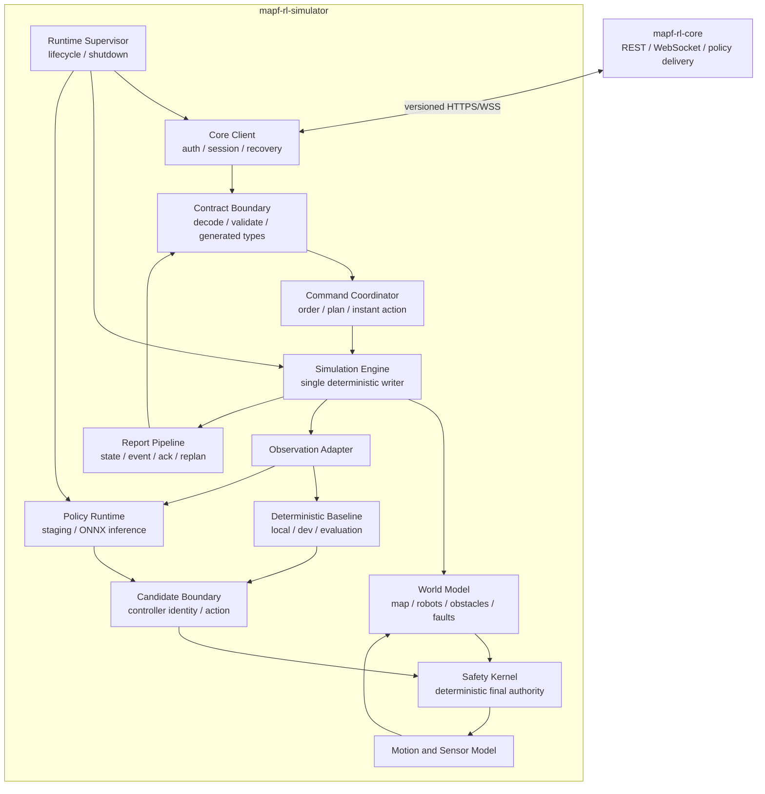
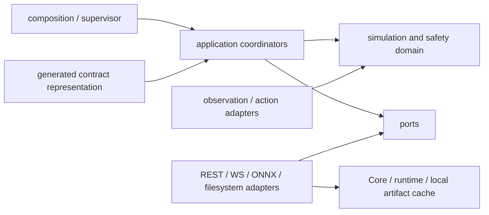
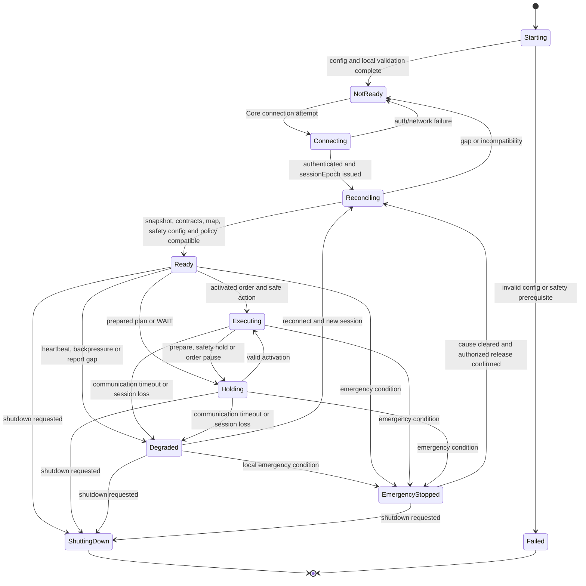
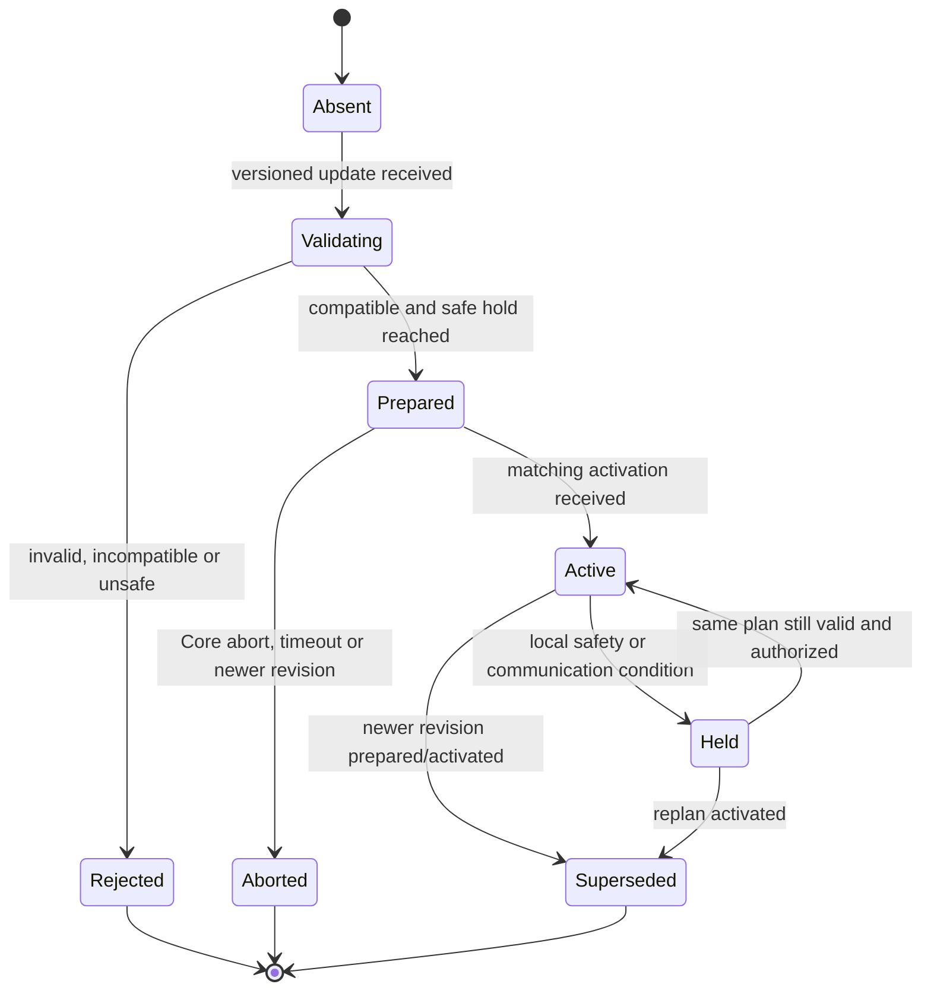
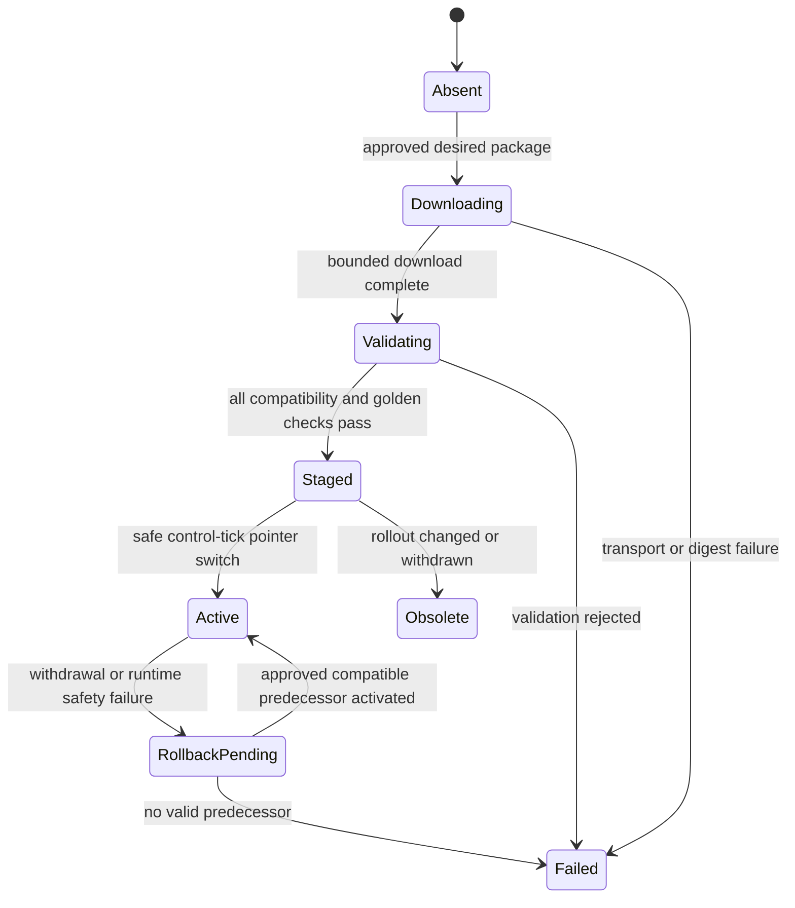

# MAPF-RL Simulator 설계서

> - 상태: Phase 3 Multi-robot plan과 recovery 기준선 v0.6
> - 대상 저장소: `mapf-rl-simulator`
> - 기준일: 2026-08-22
> - 상위 기준: [`../../mapf-rl-docs/ARCHITECTURE.md`](../../mapf-rl-docs/ARCHITECTURE.md)
> - Core 대응 설계: [`../../mapf-rl-core/docs/DESIGN.md`](../../mapf-rl-core/docs/DESIGN.md)
> - 구현 지침: [`../AGENTS.md`](../AGENTS.md)
> - 주의: 이 문서의 버전은 REST, WebSocket, observation, action, normalization, policy package의 계약 버전과 별개다.

## 1. 문서 목적과 판단 기준

이 문서는 시스템 아키텍처가 정한 책임 경계를 Simulator 내부의 구현 가능한 구조로 구체화한다. Core 통신, Order 적용, simulation time, virtual robot, local ONNX inference, deterministic safety, telemetry와 복구 사이의 의존성 및 최초 구현 기준선을 정의한다.

현재 저장소에는 generated contract representation과 compile/drift test, Phase 1의 single-robot
deterministic engine, Phase 2의 authenticated Core session vertical slice 및 Phase 3의 multi-robot
plan/recovery domain이 구현되었다. Phase 3는 prepare barrier와 dependency activation, atomic fleet tick,
stationary reservation, crossing/corridor/deadlock recovery, bounded priority report queue 및 fenced safety
checkpoint recovery를 포함한다. ONNX runtime은 아직 없다.

판단 표시는 다음과 같다.

| 표시 | 의미 |
|---|---|
| **확정 사항** | 상위 아키텍처, Core 대응 설계와 저장소 지침이 요구하는 책임, 금지 조건 또는 불변 조건 |
| **확정 기본선** | 최초 구현과 운영에 적용하는 구체적인 선택. 변경 시 영향도에 따라 ADR과 contract version 변경이 필요 |
| **향후 확장** | 현재 기준선에는 포함하지 않으며 요구가 생기면 별도 계약과 검증을 거쳐 추가하는 기능 |

문서 간 충돌 시 적용 순서는 다음과 같다.

1. 워크스페이스 `AGENTS.md`
2. 현재 시스템 기준선인 `mapf-rl-docs/ARCHITECTURE.md`
3. Simulator 저장소 `AGENTS.md`
4. Core가 소유한 canonical contract와 `mapf-rl-core/docs/DESIGN.md`
5. 이 문서
6. 개별 ADR과 구현 문서

상위 책임 경계, 외부 계약 또는 safety 기준을 변경해야 하는 ADR은 이 문서만 수정해서 확정할 수 없다. Core, FE와 Simulator의 producer/consumer 영향을 분석하고 시스템 아키텍처와 canonical contract를 함께 갱신해야 한다.

## 2. 목표, 비목표와 핵심 불변 조건

### 2.1 목표

Simulator는 다음을 제공한다.

- Rust와 Tokio 기반의 다중 virtual robot runtime
- Core의 versioned REST/WebSocket 계약을 사용하는 인증·session·reconciliation client
- Core가 전달한 Order, global goal, route constraint와 `PlanRevision`의 검증·prepare·activation
- wall-clock과 분리된 deterministic simulation time과 재현 가능한 event scheduling
- versioned map, robot capability, kinematics, sensor와 fault simulation
- Core training contract와 정확히 일치하는 observation·action·normalization adapter
- 승인된 immutable ONNX policy package의 검증, staging, local CPU inference, activation과 rollback
- policy confidence와 독립적인 deterministic safety enforcement 및 최종 stop 권한
- versioned robot state, telemetry, event, ack와 replan trigger 보고
- disconnect, timeout, malformed input과 process restart에 대한 fail-closed 복구

### 2.2 비목표

Simulator는 다음을 소유하지 않는다.

- 전역 MAPF, reservation 권위, Order lifecycle 또는 `orderUpdateId` 발급
- RL training, evaluation 승인, ONNX export 또는 policy approval/withdrawal
- PostgreSQL, Redis 또는 Core 내부 storage representation 접근
- FE operator workflow나 화면 상태
- Core credential 발급, operator 인증 또는 emergency-stop 해제 권한
- 초기 범위의 physical robot control, Raw TCP 또는 MQTT 기반 VDA5050 transport compliance
- policy output을 검증 없이 motion에 직접 적용하는 경로
- certified safety controller 또는 별도 certified emergency channel을 제공한다는 주장

### 2.3 핵심 불변 조건

**확정 사항**

1. Simulator는 Core의 versioned REST/WebSocket API만 사용하고 Redis/PostgreSQL에 접근하지 않는다.
2. Core는 global goal과 constraint를 제공하지만 Simulator는 unsafe action을 거부·감속·정지할 최종 권한을 가진다.
3. Raw policy output은 motion command가 아니며 typed candidate action과 deterministic safety pipeline을 반드시 거친다.
4. 인증, contract compatibility와 snapshot reconciliation이 완료되기 전 `Ready` 또는 motion 상태로 전이하지 않는다.
5. `orderUpdateId`의 stale, conflicting duplicate 또는 gap을 arrival time으로 보정하거나 추측하지 않는다.
6. 같은 scenario, seed, resolved config, map, model artifact와 event sequence는 같은 simulation 결과를 만들어야 한다.
7. Simulation state 변경은 단일 deterministic ordering point에서만 commit한다.
8. Wall-clock은 network timeout과 operational watchdog에만 사용하고 simulation ordering이나 physics `dt`의 근거로 사용하지 않는다.
9. 외부 숫자, model tensor와 artifact metadata의 range, shape, dtype, NaN/Infinity를 boundary에서 검증한다.
10. Safety config, map, observation/action/normalization 또는 현재 선택된 controller가 없거나 incompatible하면 fail closed한다. Policy mode에서는 승인·검증된 active package가 필요하며 staged package만으로 대체할 수 없다.
11. Blocking I/O, ONNX inference와 CPU-heavy collision/sensor 계산으로 Tokio async executor를 막지 않는다.
12. 모든 queue와 replay buffer는 bounded하며 overflow를 성공이나 command 적용으로 해석하지 않는다.
13. Command 수신, prepare/application ack, activation ack와 실제 execution state를 서로 다른 사실로 보고한다.
14. Emergency stop은 단순 Core 상태 동기화로 강제 해제할 수 없다. Local cause 해소와 Core가 인가·감사한 typed operator release command를 모두 확인해야 한다.
15. 이전 `sessionEpoch`, stale boot/report identity와 늦게 끝난 inference result는 current state를 변경할 수 없다.

## 3. 논리 아키텍처와 실행 경계



### 3.1 실행 역할

| 역할 | 실행 성격 | 입력 | 출력 | 핵심 제약 |
|---|---|---|---|---|
| Runtime Supervisor | async control plane | config, shutdown, task health | lifecycle transition, bounded shutdown | task panic/failure를 숨기지 않음 |
| Core Client | async I/O | REST/WS, auth material | validated message, delivery result | DB 접근 금지, reconnect 시 motion 재개 금지 |
| Command Coordinator | async control plane | validated Core command | engine command, ack intent | version/session/plan ordering 보존 |
| Simulation Engine | deterministic state owner | scheduled event, command, inference result | committed state transition, report intent | 한 시점에 하나의 writer, wall-clock 비의존 |
| Candidate Controller | pure 또는 CPU worker boundary | observation, explicit controller mode | versioned candidate 또는 typed failure | silent mode 전환 금지, 동일 Action contract 사용 |
| Policy Runtime | blocking/CPU worker boundary | immutable package, observation | candidate action 또는 typed failure | active pointer 원자 전환, stale result 폐기 |
| Safety Kernel | pure/CPU domain | candidate, world/order/config snapshot | safe action, wait 또는 stop decision | policy와 network에서 독립 |
| Motion/Sensor Worker | CPU worker 또는 engine-owned pure step | state와 safe action | deterministic next state/observation inputs | stable iteration order와 injected randomness |
| Report Pipeline | async I/O | committed report intent | WS report 또는 recovery record | bounded, priority-aware, sequence 보존 |

### 3.2 Tokio task와 state ownership

**확정 기본선**

- Async task는 network session, artifact download, command coordination, report publish와 supervisor에 사용한다.
- Authoritative simulation state는 Simulation Engine만 변경한다. 다른 task는 immutable snapshot 또는 typed command/result만 전달한다.
- Task 간 전달은 bounded channel을 사용한다. Channel capacity와 overflow 정책은 typed config로 관리하고 무제한 channel을 금지한다.
- ONNX inference, archive/hash/signature 검증, filesystem access와 측정상 무거운 collision/sensor 계산은 전용 worker pool 또는 명시적 blocking boundary로 격리한다.
- Worker result는 invocation identity, target control tick, input state identity와 policy digest를 포함한다. Engine은 현재 tick/state/policy와 일치할 때만 결과를 적용한다.
- Mutex를 잡은 채 `.await`, inference 또는 filesystem I/O를 수행하지 않는다.
- Task failure는 supervisor로 전파한다. Safety, engine 또는 command coordinator의 비정상 종료는 전체 runtime을 `Not Ready`/stopped로 전환한다.
- Network/report task failure는 motion을 계속 허용하는 근거가 아니다. Communication timeout과 lifecycle 규칙으로 degraded/stop을 결정한다.

### 3.3 내부 의존성 방향



**확정 사항**

- Simulation, kinematics와 safety domain은 Tokio, HTTP/WebSocket client와 ONNX runtime concrete type에 의존하지 않는다.
- 외부 message를 schema와 semantic validation한 뒤 typed domain command로 변환한다.
- Generated contract representation과 internal state model을 분리한다.
- Composition root 이외에서 concrete network client, global clock, random generator 또는 global configuration을 만들지 않는다.

### 3.4 Process와 robot cardinality

Simulation Engine은 하나의 process/scenario에서 여러 virtual robot과 공통 world를 결정론적으로
계산한다. Core의 인증·session 권위 단위는 `simulatorId`이고 credential은 허용된 robot ID 집합에
binding된다.

- 한 process는 하나의 credential/session/`sessionEpoch`를 사용하며 report마다 `robotId` binding을
  검증한다.
- `simulatorBootId`는 process start identity이고 `reportSequence`는
  `(simulatorId, simulatorBootId)` 전체 robot report의 단일 순서다.
- 한 robot의 domain reconciliation 실패가 다른 robot version을 바꾸지는 않지만 session auth,
  sequence gap 또는 공통 world/engine/safety failure는 영향받는 모든 robot을 fail-safe stop한다.
- Multi-robot 병렬 계산도 최종 world commit과 collision/safety 판정의 stable robot ordering을 우회하지 않는다.

## 4. 목표 소스 구조

실제 기능을 추가할 때만 다음 디렉터리와 crate/module을 만든다. 구조를 맞추기 위한 빈 placeholder는 만들지 않는다.

```text
mapf-rl-simulator/
├── Cargo.toml
├── src/
│   ├── main.rs                 # composition root
│   ├── runtime/                # supervisor, lifecycle, task health
│   ├── config/                 # profile loading and typed validation
│   ├── contracts/              # generated Core representations and mapping
│   ├── core_client/            # REST, WebSocket, auth, reconnect
│   ├── session/                # epoch, boot/report sequence, reconciliation
│   ├── command/                # Order, PlanRevision, instant action handling
│   ├── simulation/             # clock, event queue, deterministic engine
│   ├── world/                  # map, robot, obstacle and reservation view
│   ├── motion/                 # kinematics and actuator simulation
│   ├── sensing/                # deterministic sensor simulation
│   ├── controller/             # explicit baseline/policy candidate boundary
│   ├── policy/                 # package, observation, inference and action
│   ├── safety/                 # deterministic final safety boundary
│   ├── fault/                  # seeded fault and network condition injection
│   └── telemetry/              # state, event, ack and metrics projection
├── config/                     # non-secret YAML profiles when implemented
├── tests/                      # contract, scenario, recovery, integration
├── scenarios/                  # versioned deterministic test fixtures
└── docs/                       # design and ADRs
```

**확정 기본선**

- 외부 계약의 canonical source는 Core에 둔다. `src/contracts`는 생성물 또는 같은 fixture로 검증되는 consumer representation만 포함한다.
- `simulation`, `world`, `motion`, `sensing`, `safety`는 가능한 한 pure library module로 유지한다.
- `core_client`, ONNX와 local cache adapter는 port를 구현하며 domain에 concrete error/type을 누출하지 않는다.
- Rust workspace/crate 분리는 실제 vertical slice와 compile-time 경계가 필요할 때 ADR로 도입한다. 초기부터 빈 crate를 만들지 않는다.

## 5. Runtime lifecycle과 readiness

### 5.1 Simulator lifecycle

Simulator runtime은 최소 다음 논리 상태를 가진다.



상태명은 Simulator 내부 lifecycle이며 Core의 Order lifecycle과 별개다. Wire contract가 이 이름을 그대로 사용한다고 가정하지 않는다.

### 5.2 `Ready` gate

**확정 사항**

다음 조건을 모두 충족해야 `Ready`가 될 수 있다.

1. `MAPF_PROFILE`과 resolved config가 typed validation을 통과했다.
2. Simulator API key 인증과 robot binding이 성공했다.
3. Active `sessionEpoch`가 발급되고 이전 session이 fence 처리되었다.
4. REST/WS, message와 policy contract version이 compatible하다.
5. Authoritative Order, map, robot capability와 controller/policy snapshot reconciliation이 완료되었다.
6. Map digest, coordinate frame와 unit metadata가 검증되었다.
7. Footprint, minimum separation, velocity·acceleration·angular-rate limit 등 versioned safety config가 완전하다.
8. 현재 실행 mode의 active controller가 검증되었다. Operational policy mode에서는 승인된 active policy package가 필요하고, staged candidate는 기존 active package를 대신하지 않는다.
9. Emergency stop, blocking fault 또는 report/order gap이 없다.
10. Engine, safety, selected controller, Policy mode의 inference와 report critical task가 healthy하다.

`Ready`는 motion 허가가 아니다. 실제 action은 current Order/plan activation과 매 control tick의 safety decision을 추가로 통과해야 한다.

### 5.3 시작과 종료

**확정 기본선**

- 시작 시 config → local identity/boot ID → Core authentication → session fencing → snapshot reconciliation → map/safety/controller와 필요한 policy artifact validation 순서로 진행한다.
- 새 process마다 `simulatorBootId`를 새로 생성하고 boot 안의 `reportSequence`는 첫 report부터 단조 증가시킨다.
- Process restart 후 이전 local state만으로 motion을 재개하지 않는다.
- 종료 시 새 command 적용과 policy activation을 중단하고, robot을 safe hold/stop으로 전환한 뒤 중요한 ack/event를 bounded drain한다.
- Drain timeout 뒤에도 motion state보다 process 종료를 우선해 거짓 `Ready`를 남기지 않는다. 종료 완료 여부는 다음 session reconciliation으로 확정한다.
- Local cache나 checkpoint write가 실패해도 unsafe motion을 계속하지 않는다.

## 6. 설정과 secret 경계

### 6.1 Profile과 loading

```text
application.yaml
application-local.yaml
application-dev.yaml
application-production.yaml
```

**확정 사항**

- `MAPF_PROFILE=local|dev|production`을 필수로 지정하고 missing/unknown 값 또는 암묵적 fallback을 허용하지 않는다.
- 우선순위는 `application.yaml` < `application-{profile}.yaml` < runtime environment다.
- Simulator 환경 변수는 `MAPF_SIMULATOR_` prefix를 사용하고 profile 선택에만 `MAPF_PROFILE`을 사용한다.
- YAML은 non-secret 설정만 포함한다. API key와 trust/signing private key를 저장하지 않는다.
- `local`의 HTTP/WS 예외는 loopback에만 허용하고 `X-API-Key` 인증은 유지한다.
- `dev`와 `production`은 HTTPS/WSS를 사용한다. Production secret은 platform-managed secret manager에서 주입하고 `.env`에 의존하지 않는다.
- `.env`는 개인 local 실행용이며 실제 `.env`와 `.env.*`는 Git에서 제외한다. `.env.example`에도 동작하는 secret을 넣지 않는다.
- Resolved config는 시작 시 unknown field, range, unit과 상충 조건을 검증한다. Secret은 presence 또는 fingerprint만 기록한다.

### 6.2 설정 영역

Typed config는 최소 다음 영역을 구분한다.

| 영역 | 예시 의미 | 검증 원칙 |
|---|---|---|
| identity | Simulator/robot binding identity | Core snapshot과 일치해야 함 |
| Core transport | base URL, REST/WS timeout, TLS, reconnect | profile의 보안 조건과 일치 |
| credential | API key injection reference | raw value 출력·직렬화 금지 |
| simulation | control tick, seed | 명시적 단위, 양수 범위 |
| robot/motion | motion model과 capability reference | Core의 versioned capability와 reconcile |
| safety | clearance, timeout, horizon, fallback | 누락 또는 완화 충돌 시 fail closed |
| policy | cache/staging limit, inference budget, trust key | package compatibility와 digest 검증 |
| telemetry | rate, queue/replay bound, batch | 중요한 event가 일반 sample보다 우선 |
| observability | log/trace/metric export | secret redaction과 cardinality 제한 |

Robot capability와 safety limit의 authoritative version은 Core contract가 소유한다. Local setting은 더 보수적으로 제한할 수 있지만 Core가 준 안전 한도를 완화할 수 없다. 두 값이 충돌하면 더 안전한 값으로 자동 해석하기보다 `Not Ready`와 명시적 mismatch를 보고한다.

## 7. Core contract boundary

### 7.1 소유권과 consumer 원칙

| 계약군 | canonical owner | Simulator 역할 | Simulator 동작 |
|---|---|---|---|
| REST request/response/error | Core | producer/consumer | 생성 또는 검증된 representation 사용 |
| WebSocket envelope/message | Core | duplex producer/consumer | identity/version/session을 dispatch 전 검증 |
| Order/instant action | Core | consumer, ack producer | local safety와 version 검증 후 적용 여부 보고 |
| Map/version | Core | consumer | immutable identity/digest/frame/unit 검증 |
| Robot State/Event/Ack | Core contract | observed report producer | local fact와 Core accepted projection을 구분 |
| Plan revision/replan | Core contract | trigger/ack consumer-producer | prepare barrier와 activation dependency 준수 |
| Observation/Action/Normalization | Core | runtime adapter producer/consumer | training과 byte/semantic parity 검증 |
| Policy package/rollout | Core | download/stage/activate/rollback consumer | 승인·compatibility·signature를 독립 검증 |
| Storage schema | Core 내부 | 역할 없음 | 접근·복제·추론 금지 |

**확정 기본선**

- REST는 `/api/v1`, WebSocket은 `/ws/v1`, 최초 public contract는 `1.0.0`이다.
- 현재 major와 직전 major를 최소 6개월 병행 지원하는 Core rollout에 맞춰 두 version의 consumer compatibility를 유지한다.
- REST canonical source는 OpenAPI 3.1, WS와 policy contract는 JSON Schema 2020-12 및 fixture다.
- Rust representation은 Core schema에서 생성해 이 저장소에 commit하고 Core의 valid/invalid fixture를 그대로 실행한다.
- Unknown optional field는 같은 major에서 무시할 수 있다. Unknown required semantics, incompatible major/schema 또는 policy contract는 전체 message/package를 거부한다.
- RFC 9457 Problem Details의 stable error code, retryability와 correlation을 보존한다.
- Phase 2 이후 새 use case에 canonical endpoint/message가 없으면 logical 이름만 사용하고 새 Core
  schema/fixture보다 먼저 wire contract를 수작업으로 만들지 않는다.

### 7.2 REST와 WebSocket 역할

| 경로 | 정상 용도 | 사용 금지 또는 제한 |
|---|---|---|
| REST | authoritative snapshot, map/policy metadata와 package 조회, history, reconciliation, WS fallback snapshot | 10 Hz telemetry 대체 금지 |
| WebSocket | Order/instant action 수신, heartbeat/session, telemetry/event/replan/ack upstream | exactly-once 또는 완전 순서 가정 금지 |

- Simulator REST 요청과 WebSocket handshake는 `X-API-Key` header를 사용한다.
- API key를 URL, query, JSON payload, WebSocket message, log 또는 error context에 포함하지 않는다.
- WS fast path가 unavailable할 때만 5초 간격 REST polling으로 snapshot을 복구한다.
- Resume cursor는 Core가 발급하는 event sequence이며 15분 또는 10,000건 중 먼저 도달하는 범위만 replay할 수 있다.
- Replay gap이 범위를 벗어나면 silent skip하지 않고 REST authoritative snapshot으로 전환한다.
- Core로 보내는 durable side effect report는 REST/WS transport와 무관하게 client-generated UUIDv4
  `requestId`를 포함한다. 결과가 불명확한 retry는 같은 operation과 동일 `requestId`를 유지한다.
- Periodic `robot.state.report`는 `requestId`를 사용하지 않고 `messageId`와
  `(simulatorId, simulatorBootId, reportSequence)`로 identity/order를 판정한다.
- Validation, auth, contract incompatibility, idempotency conflict와 domain conflict는 자동 retry하지 않는다. Retry 가능한 dependency 오류만 full-jitter exponential backoff로 250 ms부터 30초 상한, 최대 5회 재시도한다.

### 7.3 Boundary validation 순서

Inbound message는 다음을 모두 통과한 뒤에만 domain command가 된다.

```text
transport/frame/size validation
  -> authenticated active session validation
  -> envelope schema/type/version validation
  -> producer authorization and robot binding
  -> sessionEpoch and stable identity validation
  -> entity/map/order/plan version validation
  -> field unit/range/finite validation
  -> message-specific semantic validation
  -> typed domain command mapping
```

부분 payload를 적용하거나 validation 실패 field만 default로 보정하지 않는다. Single WebSocket message 최대 크기는 Core 기준과 같은 1 MiB다. 더 낮은 local limit을 사용하려면 supported contract capability로 협상하고 Core와 함께 검증해야 한다.

### 7.4 VDA5050 경계

공식 VDA5050 `3.0.0`의 `order`, `state`, `instantActions` semantic subset을 사용한다. 채택한 official field의 type, required 조건과 enum은 엄격하게 검증한다. MAPF metadata는 Core envelope 또는 별도 Core contract에 두며 VDA5050 payload에 임의 field를 삽입하지 않는다.

REST/WebSocket JSON 교환은 MQTT topic, broker behavior와 QoS를 포함한 VDA5050 transport compliance가 아니다. MQTT adapter는 v1 범위가 아니며 향후 추가되어도 Core boundary와 Simulator safety를 우회할 수 없다.

## 8. Session, ordering과 reconciliation

### 8.1 Session identity와 fencing

Core가 simulator credential과 allowed-robot binding을 확인한 뒤 PostgreSQL에서 simulator identity별
단조 증가 `sessionEpoch`를 발급한다. Simulator는 다음 규칙을 적용한다.

- 새 epoch를 수용하면 이전 WebSocket, pending network response와 command context를 fence 처리한다.
- 모든 command, ack, state와 event를 current epoch에 연결한다.
- 이전 epoch의 command는 적용하지 않고 current projection을 변경하지 않는다.
- Simulator-originated report에는 process마다 새 `simulatorBootId`와
  `(simulatorId, simulatorBootId)` 전체 robot에 걸친 단조 증가 `reportSequence`를 포함한다.
- 같은 epoch/boot/sequence duplicate는 side effect 없이 같은 outcome을 재보고할 수 있다.
- 작은 sequence는 stale이며 current state를 변경하지 않는다.
- Sequence gap은 `Degraded`/`Not Ready`와 reconciliation을 요구한다.
- Timestamp는 epoch, sequence 또는 entity version을 대체하지 않는다.

### 8.2 재연결 흐름

```mermaid
sequenceDiagram
    participant S as Simulator
    participant C as Core

    S->>S: stop or enter safe degraded state
    S->>C: reconnect with X-API-Key
    C-->>S: authenticated robot binding + new sessionEpoch
    S->>C: supported contracts, boot/report sequence, last applied order/plan, active controller/policy, local state
    C-->>S: authoritative order/map/controller-policy snapshot and reconciliation result
    S->>S: validate contract, map, safety, order and controller
    alt exact or safely reconcilable
        S->>C: synchronized ack in new epoch
        S->>S: Ready; await valid activation before motion
    else gap, mismatch or unsafe state
        S->>S: remain stopped / Not Ready
        S->>C: typed error or replan trigger
    end
```

**확정 사항**

- Reconnect 자체는 motion resume 조건이 아니다.
- Simulator는 local last-applied `orderUpdateId`, `planRevisionId`, content identity, active controller mode/identity, Policy mode의 policy identity/version/digest와 lifecycle을 보고한다.
- Core snapshot과 다른 경우 local 값을 권위 있다고 주장하지 않는다. 단, Simulator가 실제 관측한 pose/fault/safety 상태는 local fact로 보고하며 Core command로 덮어쓰지 않는다.
- Pending command redelivery는 identity와 content digest로 멱등 처리한다.
- Gap, incompatible contract, controller/policy mismatch, unsafe pose 또는 unresolved emergency stop이 있으면 stopped/`Not Ready`를 유지한다.

### 8.3 Heartbeat와 communication timeout

Heartbeat 주기는 5초이며 15초 동안 유효한 heartbeat 또는 message가 없으면 session을 `Degraded`로 보고 local fail-safe 감속·정지를 시작한다. Network reconnect가 timeout 전에 성공하더라도 active epoch와 snapshot reconciliation 없이는 command를 계속 적용하지 않는다.

Communication timeout 판정은 injected monotonic elapsed time을 사용한다. 발생·해제 decision을 event sequence에 기록해 replay 시 동일한 logical event로 재현한다.

## 9. Order와 `PlanRevision` 적용

### 9.1 `orderUpdateId` 규칙

Core만 order별 `orderUpdateId`를 발급한다. 첫 update는 `0`이고 이후 값은 1씩 strictly consecutive하게 증가한다.

| 수신 update | Simulator 동작 | ack/report |
|---|---|---|
| expected next ID | content와 dependency를 검증하고 prepare | success/reject를 stable identity와 연결 |
| current ID + same digest | 재실행하지 않음 | 이전 outcome을 idempotent ack |
| current ID + different digest | contract violation, stopped 유지 | conflict reject와 incident |
| current보다 작은 ID | stale no-op | stale/duplicate outcome |
| expected보다 큰 ID | buffer하지 않고 stop, `Not Ready` | gap과 REST reconciliation 요청 |

Order timestamp나 WS 도착 순서로 gap을 메우지 않는다. Local durable checkpoint가 있더라도 Core authoritative snapshot과 digest를 확인하기 전에는 current update로 간주하지 않는다.

### 9.2 Local plan state

Simulator 내부 plan 적용 상태는 다음 의미를 분리한다.



이 상태는 Core Order lifecycle의 `Dispatched`, `Applied`, `Executing`, `Held`와 일대일 persistence model이 아니다. Simulator는 application/prepare ack와 별도 runtime execution report를 보내고 Core가 authoritative lifecycle transition을 결정한다.

### 9.3 Prepare barrier와 activation dependency

**확정 사항**

- 하나의 multi-robot 결과는 immutable `planRevisionId`와 영향받는 `(robotId, orderId, orderUpdateId, contentDigest)` 집합을 가진다.
- Simulator는 자기 대상 update뿐 아니라 map, contract, global constraint, activation dependency와 local safety prerequisite를 검증한다.
- Prepare 중에는 safe hold를 유지하며 새 경로로 motion하지 않는다.
- Compatible update를 저장하고 safe hold에 도달한 뒤에만 prepare/application ack를 보낸다.
- Core는 모든 필수 대상의 prepare ack를 15초 안에 모은 뒤 Planner가 정한 dependency 순서로 activate한다.
- Simulator는 matching `sessionEpoch`, `planRevisionId`, order update와 activation identity가 모두 일치할 때만 active pointer를 전환한다.
- Activation ack는 plan 선택을 뜻하며 실제 motion 시작은 다음 control tick의 lifecycle와 safety gate를 통과해야 한다.
- Abort, prepare timeout 또는 dependency mismatch 시 prepared plan을 폐기하고 hold/replan한다.
- Activation 시작 뒤 downstream failure가 발생하면 다음 release를 추측하지 않고 local hold/stop과 replan trigger를 수행한다.
- 아직 release되지 않은 robot은 stationary obstacle/reservation으로 취급한다. 동시에 움직여야만 안전한 plan은 v1에서 지원하지 않는다.

### 9.4 Instant action

Instant action도 stable command identity, active epoch와 schema/version을 검증한다. Emergency stop 또는 hold는 local safety를 강화하므로 현재 tick의 motion commit보다 먼저 safe transition을 시작하되 command ack와 실제 정지 완료 state를 분리한다.

Operator authorization과 audit의 권위자는 Core다. Simulator는 operator credential을 직접 처리하지 않으며, Core가 인가·감사 후 current session으로 전달한 명시적 typed release command의 identity/version/epoch와 local cause-clear를 확인한 경우에만 수용한다. Snapshot의 상태 변화나 일반 resume command를 release로 추론하지 않는다. Simulator API key로 release를 자체 요청하거나, unsafe plan 강제 적용·safety limit 완화·승인되지 않은 policy activation을 수행할 수 없다. Core의 authorization 성공도 local safety veto를 무효화하지 않는다.

## 10. Deterministic simulation engine

### 10.1 Simulation clock

**확정 기본선**

- Simulation time은 wall-clock과 분리된 `int64 simulationTimeMs`로 관리한다.
- Control tick duration은 contract `1.0.0`에서 `100 ms`이고 scenario result에 기록한다.
- Engine은 integer tick과 integer simulation time을 authoritative ordering으로 사용하고 누적 floating-point time을 사용하지 않는다.
- Engine은 완료된 control cycle마다 configured tick을 정확히 한 번 전진시키며 physics `dt`는 고정된 tick duration을 사용한다.
- Timeout이 simulation semantics에 속하면 simulation time을, network/inference 운영 watchdog이면 injected monotonic clock을 사용하고 그 결과를 명시적 event로 기록한다.

### 10.2 Tick phase ordering

각 control tick은 다음 고정 순서로 처리한다.

1. Tick 경계까지 scheduled된 external event를 수집하고 fault spec은 현재 tick에 대해서만 deterministic하게 평가한다.
2. Current `sessionEpoch`, Order/plan과 lifecycle command를 적용하고 emergency stop, communication timeout과 blocking fault를 pre-motion guard로 평가한다.
3. Guard가 motion을 허용할 때만 current world snapshot에서 sensor와 controller observation을 생성한다.
4. 해당 tick의 candidate를 계산하거나 inference timeout/failure outcome을 만든다. 대기 중 도착한 emergency/lifecycle event 또는 input state identity를 바꾸는 world event는 candidate보다 먼저 처리하고 invocation을 cancel 또는 stale 처리한다.
5. Candidate 또는 failure fallback을 deterministic safety pipeline으로 평가해 이번 interval의 유일한 safe action을 결정한다.
6. Safe action의 swept footprint, next-state 비상 정지 envelope와 kinematic transition을 검증한 뒤 `[t, t + dt)` 구간의 motion을 적분한다. Stop outcome도 configured 감속률로 위치와 속도를 적분하며 이전 action을 재사용하지 않는다.
7. Static/dynamic collision invariant, finite state와 terminal condition을 검사하고 next world state를 원자적으로 commit한다. 비상 transition도 안전하지 않으면 state/time/fault를 commit하지 않고 scenario를 종료한다.
8. State transition, command/application/activation ack, event, metric과 telemetry report intent를 생성한다.
9. Simulation time을 정확히 한 tick 증가시킨다.

Simulation time은 inference result, timeout 또는 critical preemption outcome이 정해질 때까지 증가하지 않는다. Invocation과 result는 tick, input state identity와 controller/policy digest에 결합한다. 늦게 도착하거나 preempted되었거나 active policy가 바뀐 result는 폐기한다. Pipeline parallelism은 pre-motion guard, safety decision 또는 world commit 순서를 변경할 수 없다.

### 10.3 Event ordering과 randomness

**확정 기본선**

- Scheduled event는 `(simulationTimeMs, eventClassPriority, stableSourceId, sourceSequence)`의 total order로 처리한다. Fault range는 미리 event 목록으로 materialize하지 않고 현재 tick의 spec만 stateless RNG로 평가한다.
- 같은 tick에서는 new-session fencing, emergency stop와 motion-blocking fault/timeout이 activation과 inference result보다 먼저 처리되어야 한다. 전체 `eventClassPriority` 표는 versioned engine ADR과 regression fixture로 고정한다.
- Inference를 기다리는 동안 도착한 critical external event는 현재 decision boundary의 ordered event로 기록하고 simulation time을 전진시키기 전에 적용한다.
- 같은 tick의 robot iteration은 stable `robotId` 오름차순을 사용한다. 다른 tie-break가 필요한 contract는 version으로 명시한다.
- Randomness는 scenario master seed에서 subsystem/robot별 seed를 결정론적으로 파생한다.
- Network fault, sensor noise, dynamic obstacle와 actuator fault는 서로 분리된 random stream을 사용해 한 subsystem의 draw 횟수가 다른 결과를 바꾸지 않게 한다.
- OS random, hash map iteration order, current time과 thread completion order를 simulation logic에 사용하지 않는다.
- Floating-point 연산 순서를 고정하고 non-finite result를 즉시 typed failure로 전환한다. Cross-platform bitwise equality가 보장되지 않는 계산은 tolerance와 supported platform을 test contract에 기록한다.

### 10.4 재현 record

Scenario 실행 결과는 최소 다음 identity를 기록한다.

- scenario ID/version/digest와 master seed
- resolved non-secret config digest
- map UUID/revision/content digest
- contract version과 generated representation build identity
- controller mode/identity/config digest와, Policy mode이면 policy identity/version/package digest 및 runtime version
- Simulator source/build identity와 target platform
- control tick, fault spec identity와 실제 적용된 fault event
- ordered external event log 또는 재구성 가능한 event source identity
- terminal reason과 safety invariant result

## 11. World, map와 virtual robot model

### 11.1 Coordinate와 unit

**확정 기본선**

- Wire physical unit는 SI(`m`, `m/s`, `m/s²`, `rad`, `rad/s`, `s`)를 사용한다.
- Public timestamp는 millisecond precision RFC 3339 UTC `Z`, simulation time은 `simulationTimeMs`로 분리한다.
- World frame은 오른손 Cartesian 좌표계이며 `+x`는 동/오른쪽, `+y`는 북/위쪽, `+z`는 위쪽이다.
- Yaw는 `+x` 기준 반시계 방향 radian이다.
- Grid column은 `+x`, row는 `+y` 방향이고 cell center는 origin에서 `(column + 0.5, row + 0.5) × resolutionMeters`로 계산한다.
- Immutable map은 map UUID, 단조 증가 revision과 SHA-256 content digest로 식별한다.
- Named boundary 이외에서 degree/radian, grid/world 또는 duration 단위를 변환하지 않는다.

### 11.2 Map loading과 validation

Simulator는 Core가 제공하는 canonical map snapshot을 untrusted input으로 취급하고 다음을 확인한다.

- identity, revision, content digest와 supported schema version
- coordinate frame, origin, resolution과 axis/rotation convention
- dimensions, finite coordinate, overflow와 allocation upper bound
- obstacle/traversable topology의 일관성과 robot footprint 적용 가능성
- Order, scenario와 policy observation이 참조한 map version 일치

Map update는 immutable version 교체다. 실행 중 active Order가 참조하는 map을 in-place 수정하지 않는다. 새 map은 staging/validation 후 safe hold와 Core reconciliation을 거쳐 활성화한다.

### 11.3 Robot state와 kinematics

Virtual robot state는 최소 다음 의미를 구분한다.

- pose와 velocity/angular velocity
- commanded candidate, selected safe action과 applied actuator state
- footprint와 versioned capability/safety config
- active order/update/plan revision
- active controller mode/identity와 Policy mode의 policy identity/version/digest
- battery와 sensor/fault state
- lifecycle, connectivity, emergency stop과 safety reason
- wall-clock observation timestamp와 `simulationTimeMs`

**확정 기본선**

- Kinematics update는 pure transition `State × SafeAction × dt × FaultInput -> NextState`로 검증 가능하게 설계한다.
- V1은 공식 Ruckig `0.19.4`의 velocity-control을 사용하는 jerk-limited holonomic cardinal model이다.
  현재 이동 방향을 1-DoF 경로축으로 투영하고 Ruckig의 position, velocity와 acceleration 출력을 world
  `x/y`로 변환한다. Desired cardinal velocity는 `maxLinearSpeedMps`를 넘지 않으며 방향이 바뀌면 기존
  경로축에서 velocity와 acceleration이 0에 도달한 다음 tick부터 새 방향으로 가속한다. Cardinal
  action은 yaw를 바꾸지 않는다.
- `maxEmergencyDecelerationMps2 >= maxDecelerationMps2 > 0`과
  `maxEmergencyJerkMps3 >= maxJerkMps3 > 0`을 시작 시 검증한다. Controlled stop과 Emergency stop은
  각각의 감속·jerk limit로 Ruckig 궤적을 생성하며 정상 safety 경로에서 속도나 가속도를 즉시 0으로
  만들지 않는다. Motion과 Safety는 같은 Ruckig trajectory를 사용한다.
- Pose, velocity와 acceleration이 non-finite가 되면 즉시 incident와 stop으로 전환한다.
- Footprint 전체를 사용해 static obstacle와 robot separation을 검사하며 center-point collision만으로 안전을 판단하지 않는다.
- Collision이 발생한 상태는 metric 평균으로 상쇄할 수 없는 hard failure다.

### 11.4 Sensor와 dynamic obstacle

- Sensor output은 world snapshot, versioned sensor config, simulation time과 dedicated random stream의 pure function으로 생성한다.
- Sensor latency, noise, dropout과 occlusion은 scenario/config에 명시하고 event log로 재현 가능해야 한다.
- Dynamic obstacle state는 stable identity와 deterministic trajectory/event source를 가진다.
- Dynamic obstacle prediction horizon 기본값은 2초다.
- Sensor data가 stale, missing 또는 invalid하면 free space로 추정하지 않고 observation mask와 safety fallback을 사용한다.

### 11.5 Fault injection

Fault injection은 production code path를 우회하는 임의 mutation이 아니라 versioned scheduled event로 처리한다. 최소 범주는 다음과 같다.

- sensor delay/drop/corruption
- actuator slowdown/stuck state
- dynamic obstacle spawn/path change
- network delay/loss/duplication/reorder/disconnect
- malformed/stale/duplicate Core message fixture
- inference delay/timeout/error/NaN/Infinity
- artifact checksum/signature/schema failure

Fault는 scenario seed, 발생 simulation time, target과 parameter를 기록한다. 각 spec의 전체 tick range를
메모리에 생성하지 않고 현재 tick을 stateless RNG로 평가하며 actuator stuck 같은 지속 상태만 보존한다.
Scenario digest에는 fault spec과 실제 적용 event를 기록하고 materialized future schedule은 포함하지 않는다.
실제 safety check를 끄는 fault option은 제공하지 않는다.

## 12. Observation, policy inference와 action

### 12.1 Observation contract `1.0.0`

Canonical observation input은 다음과 같다.

| name | dtype/shape | 고정 순서 |
|---|---|---|
| `grid` | `float32[1,4,11,11]` | `staticBlocked`, `dynamicOccupied`, `foreignReserved`, `routeAllowed` |
| `goal` | `float32[1,2]` | `deltaXMeters`, `deltaYMeters` |
| `neighbors` | `float32[1,8,6]` | `deltaX`, `deltaY`, `velocityX`, `velocityY`, `radius`, `stateAge`의 명시된 SI field |
| `neighborMask` | `bool[1,8]` | valid slot만 true |

Crop은 world-aligned ego-centered이고 ego index는 `[5,5]`다. 이웃은 squared Euclidean distance
오름차순, 동률이면 UTF-8 `robotId` byte 오름차순으로 정렬한다. 빈 slot은 0과 false mask로 채운다.
Normalization은 finite/range validation 뒤 `clip → subtract offset → divide scale → mask` 순서다.

**확정 사항**

- Field 의미, 순서, shape, dtype, unit, range, mask와 normalization 적용 순서는 Core contract와 정확히 일치해야 한다.
- Orientation, channel/feature와 normalization은 Core canonical schema/fixture에서 생성하며 Simulator가
  독립 정의하지 않는다.
- 같은 world/order snapshot은 같은 observation tensor와 mask를 생성해야 한다.
- Missing/stale input 의미를 0 값과 혼동하지 않고 mask/schema 규칙으로 표현한다.
- Tensor 생성 전후에 shape, dtype, finite와 range를 검증한다.

### 12.2 Action contract `1.0.0`

Action space는 다음 5개 discrete candidate다.

```text
WAIT, NORTH, EAST, SOUTH, WEST
```

Output `actionLogits`는 finite `float32[1,5]` logit이다. Index는 `WAIT=0`, `NORTH=1`, `EAST=2`,
`SOUTH=3`, `WEST=4`이고 exact argmax tie는 가장 낮은 index다. Probability normalization은 요구하지
않는다. Wrong name/shape/dtype와 NaN/Infinity를 inference failure로 처리한다.

Action은 world-frame/grid direction의 candidate 의미이며 즉시 pose를 바꾸는 motion command가 아니다. Motion adapter가 active map, robot capability와 control tick에 맞는 candidate motion으로 변환한 뒤 safety를 통과해야 한다.

### 12.3 Inference execution

**확정 기본선**

- V1 model은 ONNX opset 18과 CPU Execution Provider를 사용한다.
- Runtime implementation은 trait 뒤에 격리하며 구체 Rust crate/version은 package compatibility와 golden test를 만족하는 ADR로 선택한다.
- ONNX session 생성과 inference는 Tokio executor 밖의 bounded CPU worker에서 수행한다.
- Invocation은 robot, control tick, input state digest, active policy digest와 monotonic sequence를 가진다.
- 한 robot에 적용 가능한 inference는 control tick당 최대 하나다. Engine은 result, explicit timeout 또는 critical preemption 중 하나가 결정될 때까지 simulation time을 전진시키지 않으며 오래된 invocation을 실행해 따라잡지 않는다.
- Inference 대기 중 emergency stop, communication loss, blocking fault 또는 observation input을 바꾸는 world event가 도착하면 motion보다 먼저 처리하고 해당 invocation result를 적용 불가로 표시한다. 같은 tick에 임의로 재추론하지 않고 `WAIT`/stop outcome으로 닫는다.
- Timeout, runtime error, wrong output와 stale result는 candidate를 폐기하고 `WAIT` 또는 stop safety path로 보낸다.
- Operational watchdog의 timeout 발생은 event로 기록한다. Deterministic fault test는 injected timeout event를 사용한다.
- Inference latency와 failure는 active policy identity/version, tick과 연결하되 high-cardinality identity를 metric label로 사용하지 않는다.

### 12.4 Controller mode와 fallback

**확정 기본선**

- Operational `Policy` mode는 Core가 승인하고 현재 robot에 active로 reconcile된 compatible package만 candidate source로 사용한다.
- Deterministic baseline controller는 초기 vertical slice와 evaluation을 위해 사용할 수 있지만 `local`/`dev`의 versioned scenario 또는 별도 승인된 evaluation 실행에서 명시적으로 선택해야 한다.
- Baseline controller도 Action contract의 candidate만 만들고 동일한 deterministic safety pipeline을 통과한다. Controller identity, version/config digest와 실행 mode를 state와 scenario result에 기록한다.
- Production에서 baseline controller를 사용하려면 Core contract에 controller identity/compatibility/reporting을 추가하고 별도 ADR과 rollout 검증을 완료해야 한다.
- Policy load/inference failure를 baseline controller로 자동 전환하지 않는다. Runtime fallback은 `WAIT`/stop 또는 Core 승인 집합의 compatible predecessor rollback뿐이다.

## 13. Policy package 수명주기

### 13.1 Package 구조

```text
policy-package/
├── model.onnx
├── manifest.json
├── observation-schema.json
├── action-schema.json
├── normalization.json
├── validation-vectors.json
├── integrity.json
└── signature.ed25519
```

`integrity.json`은 자신과 signature를 제외한 여섯 payload file의 exact path/length/SHA-256을
포함한다. RFC 8785 JCS canonical bytes를 Ed25519로 서명하고 `signature.ed25519`는 raw 64 bytes다.
완성된 deterministic `tar.gz` digest는 archive 밖 Core approval/download metadata에 둔다. Versioned
trust bundle은 `ACTIVE`, `RETIRING`, `REVOKED` key와 validity를 pin한다.

### 13.2 Download와 staging validation

Artifact와 download metadata는 untrusted input이다. Staging은 active package와 분리된 임시 위치에서 다음 순서로 수행한다.

1. Core session, robot binding, desired deployment와 approval metadata 확인
2. Core가 중개한 authenticated download URL을 사용해 bounded download size/time과 transport identity 확인. Simulator에는 object storage credential을 주입하지 않음
3. Package archive SHA-256 digest와 immutable identity 확인
4. Archive path traversal, symlink/hardlink, duplicate entry, canonical metadata와 decompression limit 검사
5. Exact file 집합과 예상하지 않은 executable/special entry 검사
6. `integrity.json` schema/JCS, trust key 상태와 Ed25519 signature 검증
7. Companion file byte length/digest와 manifest/schema parsing
8. Policy ID/version, observation/action/normalization version 일치 확인
9. Simulator와 ONNX Runtime Semantic Versioning range, opset 18/CPU compatibility 확인
10. Input/output name, shape, dtype, range와 normalization parameter 확인
11. Model load, finite smoke inference와 validation vector expected tolerance 확인
12. Staged directory를 content digest로 read-only 취급하고 결과 보고

하나라도 실패하면 staged activation success를 보고하지 않고 active package를 유지한다. Archive를 검증 전에 active/cache 위치에 덮어쓰지 않는다. Download URL, API key와 secret-bearing header는 log에 남기지 않는다.

### 13.3 Local package state



이 상태는 Core의 `PolicyPackage`, `PolicyRollout`, `RobotPolicyDeployment` aggregate를 대체하지 않는다. Simulator는 관측한 local state와 ack를 보고하고 Core가 desired/staged/active/failed projection의 권위자가 된다.

### 13.4 Activation과 rollback

**확정 사항**

- Robot이 정지했고 pending action/inference가 없는 control-tick 경계에서만 activate한다.
- Activation은 file 교체가 아니라 fully validated immutable package pointer의 원자 전환이다.
- Validation vector, smoke inference와 runtime compatibility는 pointer 전환 전에 staged package에서 모두 완료한다.
- Safe tick에서 engine이 staged digest를 다시 확인하고 active pointer와 controller generation을 하나의 local commit으로 전환한다. 이 commit이 실패하면 이전 pointer를 유지하고 activation ack를 보내지 않는다.
- Pointer 전환 뒤 첫 runtime use가 실패하면 motion을 시작하지 않고 즉시 이전 승인 package로 rollback하거나 stopped/`Not Ready`를 유지한다. Active identity report와 activation ack는 실제 active pointer/controller generation을 관측한 뒤에만 보낸다.
- Late inference result는 이전 policy digest가 붙어 있으므로 폐기한다.
- 직전 승인·호환 package를 rollback 후보로 보존한다.
- Collision/safety invariant violation, checksum/runtime 오류 또는 withdrawal 시 local stop 후 승인된 compatible predecessor로만 rollback한다.
- 승인된 predecessor가 없으면 `Not Ready`/stopped를 유지한다. Embedded 기본 policy나 승인 집합 밖 artifact로 자동 전환하지 않는다.
- Disconnected 상태에서도 승인된 local rollback set 밖으로 변경할 수 없다.

Core rollout 기준은 robot 1대 → fleet 5% → 25% → 100%다. Simulator는 fleet 진행을 스스로 판단하지 않고 자기 robot에 대한 desired deployment만 처리한다.

## 14. Deterministic safety kernel

### 14.1 책임과 입력

Safety Kernel은 policy, Core availability와 policy confidence에서 독립적인 local final authority다. 한 control tick의 immutable input은 최소 다음을 포함한다.

- Candidate action과 inference identity/failure
- Current lifecycle, active session, Order/update와 `planRevisionId`
- Current pose, velocity, footprint와 motion capability
- Map/version, allowed route/segment와 global constraint
- Static/dynamic obstacle 및 이웃 robot snapshot과 freshness
- Minimum separation과 2초 prediction horizon
- Emergency stop, communication timeout과 fault state
- Current/next simulation time과 control tick

### 14.2 검증 pipeline

Architecture의 의미 순서를 그대로 사용한다.

1. Output tensor의 shape, dtype, range, NaN/Infinity와 inference timeout 검사
2. Versioned Action schema에 따른 candidate action 변환
3. Current Order/global constraint와 허용 route/segment 검사
4. Static/dynamic obstacle clearance와 minimum robot separation 검사
5. Velocity, acceleration, angular rate와 kinematic limit 검사
6. Emergency stop, communication timeout, fault와 Simulator lifecycle 검사
7. 통과 시에만 safe action 적용; 실패 시 deterministic reject/stop 또는 사전 정의된 safe fallback

각 단계는 typed reason code와 evidence를 만들며 동일 input/config에는 동일 decision을 반환한다. Safety predicate는 policy score/confidence로 완화하지 않는다.

6단계의 emergency stop, timeout, blocking fault와 lifecycle 조건은 이미 latched되었거나 tick 중 새로 도착한 경우 pre-motion guard에서 먼저 short-circuit할 수 있다. 이는 검증을 생략하는 것이 아니라 motion 적분 전에 더 이르게 같은 reject/stop outcome을 확정하는 것이다. Guard가 motion을 금지하면 이전 tick action이나 늦게 도착한 inference result를 재사용하지 않는다.

### 14.3 Safety outcome과 우선순위

논리 outcome은 다음을 구분한다.

```text
Accept(candidate)
SubstituteWait(reason)
ControlledStop(reason)
EmergencyStop(reason)
RejectNotReady(reason)
```

- `WAIT`도 collision, lifecycle와 kinematic 조건을 다시 통과해야 한다. Safe하지 않으면 stop한다.
- Fallback은 `WAIT` 또는 stop만 허용하며 다른 방향으로 임의 우회하지 않는다.
- Emergency stop과 blocking lifecycle/fault는 lower-priority candidate보다 우선한다.
- Controlled stop은 제어 감속, Emergency stop은 비상 감속을 사용한다. 제어 감속 transition이 안전하지
  않으면 비상 감속으로 승격하며, 비상 transition도 안전하지 않으면 `CollisionInvariant` hard failure로
  종료하고 해당 tick의 state/time/fault를 부분 commit하지 않는다.
- Core command, active plan 또는 policy가 safety outcome을 override할 수 없다.
- Safety reject는 candidate/controller/inference identity, active policy가 있으면 그 identity, order/map/plan version, simulation time과 reason을 event로 보고한다.

### 14.4 Minimum safety checks

| 범주 | 검사 | 실패 동작 |
|---|---|---|
| Plan permission | active order/update/revision, allowed route/segment | WAIT/stop, replan trigger |
| Static clearance | footprint swept volume과 static obstacle | stop, safety event |
| Dynamic clearance | horizon 내 obstacle/robot predicted separation | WAIT/stop, replan trigger |
| Kinematics | speed, acceleration/deceleration, angular rate, feasibility | reject/controlled stop |
| State freshness | sensor/neighbor/order/session freshness | WAIT/stop, degraded |
| Communication | heartbeat와 active epoch | 15초 timeout 시 stop |
| Fault | actuator/sensor/runtime/package fault | fault별 fail-safe stop |
| Emergency | latched local/Core stop condition | emergency stop 유지 |

V1 footprint는 circle이다. Static check는 candidate center segment와 blocked-cell closed AABB 사이
최소 거리를 계산하고 `radius + minimumObstacleClearance + 1e-9 m` 이상일 때만 accept한다.
Candidate의 one-tick Ruckig trajectory뿐 아니라 next state의 velocity와 acceleration에서 시작하는
전체 emergency Ruckig stop trajectory도 같은 clearance를 통과해야 한다. 궤적은 고정 구간으로
표본화하고 각 chord에 `maxAcceleration × Δt² / 8`의 보수적 편차를 footprint clearance에 더한다.
Scenario 초기 state에도 동일한 stopping-envelope 검사를 적용한다.
Robot/dynamic check는 constant-velocity relative motion의 `[0, 2 s]` 연속 closest approach가 두 radius
합 + minimum separation + `1e-9 m` 이상일 때만 accept한다. Map 밖과 boundary/tolerance 접촉은
unsafe다. Floating-point epsilon을 call site마다 다르게 정의하지 않는다.

### 14.5 Emergency stop latch

Emergency stop은 latched state다.

1. Local invariant 또는 authorized stop command가 latch를 설정한다.
2. Motion은 configured emergency behavior로 전환되고 stop event를 즉시 우선 보고한다.
3. 원인이 해소되어도 자동으로 latch를 해제하지 않는다.
4. Core가 별도 권한을 가진 operator를 인가·감사한 명시적 typed release command의 identity/version/epoch, current session과 local cause-clear 검증을 모두 요구한다.
5. Release 뒤에도 reconciliation과 normal safety gate를 통과해야 `Ready`가 된다.

Simulator API key는 emergency-stop 해제 권한을 갖지 않는다. Simulator는 operator credential을 직접 처리하지 않고 Core가 소유한 authorization 결과와 command identity를 검증하되, local cause가 남아 있으면 release를 거부한다.

## 15. Telemetry, event, ack와 backpressure

### 15.1 Report identity와 의미

모든 Simulator-originated report는 가능한 범위에서 다음 context를 보존한다.

- current `sessionEpoch`, `simulatorBootId`, `reportSequence`
- stable message/report identity와 correlation/request identity
- `robotId`, `orderId`, `orderUpdateId`, `planRevisionId`
- map/contract version과 content identity
- active controller mode/identity와 active/candidate policy identity/version/digest
- UTC occurred-at과 `simulationTimeMs`
- report type별 state version, reason과 evidence

Observed local state와 Core가 accepted한 projection은 다를 수 있다. Simulator는 local report를 ack받았다는 이유로 Core Order transition을 추측하지 않는다.

### 15.2 Report class와 우선순위

| 우선순위 | Report class | Overflow 원칙 |
|---|---|---|
| 1 | emergency stop, collision/invariant, critical fault | drop/coalesce 금지; session degraded 후 recovery |
| 2 | command/prepare/activation ack, replan trigger, lifecycle transition | drop 금지; stable identity로 재전달/reconcile |
| 3 | connectivity, policy stage/active/rollback, safety rejection | durable 의미 보존, bounded retry |
| 4 | periodic robot state | 최신값 coalesce 가능, gap/freshness 표시 |
| 5 | diagnostic/high-rate sample | bounded sampling/drop 가능, drop metric 기록 |

Simulator telemetry 기본 보고율은 duplex WS 10 Hz다. High-frequency state를 REST로 전환하지 않는다. Critical report가 queue capacity 때문에 전달되지 못하면 정상 동작으로 숨기지 않고 local degraded/stop과 reconnect reconciliation을 수행한다.

### 15.3 Queue와 replay

**확정 기본선**

- 모든 outbound queue는 bounded하고 report class별 capacity/overflow 정책을 config로 검증한다.
- Periodic projection만 같은 robot/state version 기준 최신값으로 coalesce할 수 있다.
- Ack/event/replan identity는 재전송해도 Core가 멱등 처리할 수 있게 유지한다.
- WS write 성공을 Core acceptance로 간주하지 않는다.
- 최근 15분 또는 10,000건 중 먼저 도달하는 Core replay 기준과 호환되는 local report recovery 범위를 둔다. 정확한 local persistence 방식과 용량은 ADR로 확정한다.
- Replay 범위를 넘거나 sequence continuity를 증명할 수 없으면 `reportSequence`를 재사용하지 않고 snapshot reconciliation을 요구한다.

Core는 각 report에 `report.ack`를 반환한다. `ACCEPTED`/`DUPLICATE`만 spool에서 즉시 제거하고,
retryable `REJECTED`·timeout·disconnect는 같은 identity/requestId로 보존한다. Non-retryable
`REJECTED`는 local dead-letter/audit로 이동한 뒤 replay spool에서 제거한다. Durable report의
`ACCEPTED`는 Core PostgreSQL commit과 멱등 판정 완료를 뜻한다.

## 16. 장애 처리와 복구

| 장애 | Simulator 즉시 동작 | 복구 완료 조건 |
|---|---|---|
| malformed/incompatible message | 전체 message 거부, 부분 적용 금지, stop 필요성 평가 | compatible snapshot/contract reconciliation |
| stale/duplicate command | no-op 또는 이전 outcome ack | current version 유지 |
| conflicting duplicate | contract incident, hold/`Not Ready` | Core authoritative digest 확인 |
| `orderUpdateId` gap | buffer하지 않고 stop/`Not Ready` | REST snapshot과 exact next state 일치 |
| Prepare reject/timeout/abort | 새 revision 미활성화, safe hold | coherent revision 재prepare 또는 취소 |
| Activation dependency mismatch | activation 거부, hold/replan | matching Core activation과 snapshot |
| WS/heartbeat loss | degraded, 15초 timeout 감속·정지 | 새 epoch와 full reconciliation |
| Auth expiry/revocation/binding failure | request/session 중단, stop/`Not Ready` | 유효 credential로 인증·reconcile |
| Report queue overload | replaceable state만 coalesce, critical gap이면 stop | backlog 회복과 report/snapshot reconcile |
| Inference timeout/error/NaN | candidate 폐기, WAIT/stop | healthy runtime/package 또는 rollback |
| Artifact digest/signature/schema failure | candidate staging 실패, active 유지 | 새 approved compatible artifact 검증 |
| Active policy runtime failure | immediate safe stop, approved rollback 시도 | predecessor active ack 또는 stopped `Not Ready` |
| Map/config mismatch | motion 금지 | exact version과 safety validation |
| Engine/safety task failure | process-wide fail-safe stop/terminate | clean restart와 Core reconciliation |
| Process restart | motion 없음, 새 boot ID | auth, epoch, snapshot, package와 safety gate 완료 |

### 16.1 Retry 원칙

- Network/dependency retry는 full-jitter exponential backoff를 사용해 250 ms부터 30초 상한, 최대 5회 수행한다.
- Mutation retry는 같은 `requestId`, report/ack retry는 같은 stable identity를 유지한다.
- Validation, authentication/authorization, contract incompatibility, idempotency conflict와 domain conflict는 자동 retry하지 않는다.
- Retry budget 소진을 성공으로 숨기지 않고 local lifecycle과 report에 반영한다.
- Circuit breaker가 열려도 last command나 reservation을 영구 motion 허가로 사용하지 않는다.

### 16.2 Local checkpoint 원칙

Local checkpoint/cache는 재시작 최적화 수단이지 Core authority가 아니다. 보존한다면 다음 원칙을 따른다.

- Active/staged package는 immutable digest path와 atomic pointer로 저장한다.
- Applied order/plan identity와 unacknowledged report envelope는 crash-safe 형식으로 저장할 수 있지만 Core snapshot과 대조 전 current state에 사용하지 않는다.
- Process restart는 새 `simulatorBootId`와 새 boot의 `reportSequence`를 시작한다. 이전 sequence 값을 새 boot에서 이어 쓰거나 재사용하지 않는다.
- Crash 전에 저장된 report를 복구한다면 원래 `sessionEpoch`/boot/sequence identity를 보존하고 Core contract가 허용하는 history/audit recovery로만 제출한다. 이전 epoch report가 current projection이나 command outcome을 갱신하게 하지 않는다.
- Partial write, checksum mismatch 또는 unknown format은 폐기하고 `Not Ready`로 복구한다.
- API key는 checkpoint/cache에 저장하지 않는다.
- Local state가 Core와 충돌하면 motion을 멈추고 reconciliation하며 local state로 Core version을 덮어쓰지 않는다.

## 17. 보안 경계

### 17.1 인증과 권한

- 각 Simulator는 개별 256-bit opaque API key를 `X-API-Key`로 제출한다.
- Core는 key의 robot binding, scope, 상태, 만료와 폐기를 검증한다.
- Simulator credential은 binding된 robot의 state/event/ack/reconciliation과 승인된 map/policy 조회에만 사용한다.
- Order intent, operator action, policy approve/withdraw/rollback과 emergency-stop 해제 권한을 갖지 않는다.
- API key 기본 만료 90일과 7일 rotation overlap을 지원하되 raw key를 log나 local document에 남기지 않는다.
- Credential rotation 중 새 connection은 Core가 허용한 key만 사용하고 old session은 새 `sessionEpoch`로 fence 처리한다.

### 17.2 Transport와 artifact trust

- `dev`/`production`은 HTTPS/WSS와 Core server identity 검증을 요구한다.
- Redirect, proxy와 download host 정책은 credential forwarding을 제한하고 secret header를 다른 origin에 전달하지 않는다.
- Policy signature public key는 deployment config에 pin하며 package 안의 key를 신뢰하지 않는다.
- Artifact private signing key는 Simulator에 존재하지 않는다.
- Archive extraction은 path와 resource limit을 강제하고 staging directory 밖 write를 허용하지 않는다.
- Core message, map, schema, package와 model output은 모두 untrusted input으로 취급한다.

### 17.3 Secret redaction

Raw API key, download credential, token, environment dump와 secret-bearing header를 log, metric, trace, event, crash report 또는 support bundle에 포함하지 않는다. 인증 관측에는 Core가 제공하는 credential ID 또는 non-secret fingerprint만 사용한다.

## 18. 관측 가능성

### 18.1 Correlation

Log, trace, event와 metric exemplar에는 가능한 범위에서 다음을 연결한다.

- request/message/report/inference identity
- `robotId`, `orderId`, `orderUpdateId`, `planRevisionId`
- `sessionEpoch`, `simulatorBootId`, `reportSequence`
- map, contract, controller mode/identity와 policy identity/version/digest
- wall-clock UTC와 `simulationTimeMs`
- lifecycle, safety decision과 reason code

`robotId`, `orderId`, `requestId`처럼 high-cardinality 값은 metric label로 사용하지 않고 log/trace에 둔다.

### 18.2 최소 metric

| 영역 | Metric 범주 |
|---|---|
| Runtime | lifecycle, task restart/failure, tick duration/overrun, queue depth |
| Session | connection, auth, epoch fencing, heartbeat age, reconnect/reconcile result |
| Contract | decode/validation/version error, stale/duplicate/gap |
| Simulation | tick count, simulation time, robot count, scenario terminal reason |
| Motion/Sensor | kinematic violation, stale/drop/noise/fault count |
| Safety | accept/wait/controlled stop/emergency stop/reject reason |
| Policy | download/stage/activate, inference latency/error/timeout, active version, rollback |
| Report | publish latency, queue age/depth, coalesce/drop, ack/replay gap |
| Outcome | success, collision/risk, makespan, distance, wait, deadlock, replan |

### 18.3 Log, trace와 audit event

- OpenTelemetry context를 사용해 Core correlation과 연결한다.
- Wall-clock과 simulation time을 항상 구분한다.
- Safety reject/stop, emergency latch/release, fault, replan, policy stage/activation/rollback, auth failure와 reconciliation 결과를 구조화한다.
- Raw secret, full tensor와 과도한 world snapshot을 기본 log에 기록하지 않는다.
- 전체 시스템 보존 기준은 log 30일, trace 7일, metric 13개월이다. Simulator exporter가 backend retention을 소유하지는 않는다.

## 19. 테스트 전략

### 19.1 계층별 검증

| 계층 | 필수 검증 |
|---|---|
| Unit/domain | clock/event ordering, pre-motion stop 선점, unit conversion, kinematics, sensor, observation ordering, action mapping, safety predicate |
| Contract | Core valid/invalid fixture, unknown version/field, plan/activation, epoch/report sequence, ack semantics, RFC 9457 |
| Session | auth/binding, old epoch fencing, restart 시 새 boot/sequence, 과거 report history 격리, duplicate/stale/gap, reconnect/snapshot |
| Order/plan | `orderUpdateId` stale/duplicate/conflict/gap, prepare barrier, abort, activation dependency |
| Policy | archive security, digest/signature, schema/runtime compatibility, shape/dtype/range, golden vector, 전환 전 검증, atomic activation/rollback |
| Safety | route, footprint clearance, separation, limits, stale state, timeout, inference 중 emergency 선점, emergency latch/release |
| Scenario | crossing, narrow corridor, swap, bottleneck, deadlock, dynamic obstacle, no-safe-path |
| Fault/recovery | delay/loss/duplicate/reorder, disconnect, report overload, process restart, invalid artifact, inference timeout/NaN |
| Performance | control tick deadline, inference distribution, collision/sensor workload, bounded memory/backpressure |
| End-to-end | Core auth→reconcile→Order prepare→activate→execute→replan, policy stage→activate→rollback |

### 19.2 Determinism과 golden test

- 같은 scenario/seed/config/map/controller/policy/event log를 최소 두 번 실행해 state/event/metric digest를 비교한다.
- Hash map/thread completion 순서가 결과에 영향을 주지 않는 stress test를 둔다.
- Simulation time test는 injected clock을 사용하고 wall-clock sleep에 의존하지 않는다.
- Python exporter와 Rust runtime은 `validation-vectors.json`의 tensor, output과 tolerance로 parity를 검증한다.
- Neighbor ordering, mask, normalization 순서와 discrete action tie-break를 cross-runtime fixture로 고정한다.
- Collision과 safety invariant violation은 hard failure다.

### 19.3 Safety regression matrix

최소 다음 조합을 seeded regression으로 유지한다.

- 교차로 동시 진입과 근접 통과
- 좁은 corridor의 양방향 진입과 stationary unreleased robot
- Swap conflict, bottleneck과 deadlock
- Dynamic obstacle이 2초 horizon에 진입/이탈
- Sensor stale/drop과 이웃 report gap
- Communication timeout 직전/직후 command arrival
- Prepare 일부 성공, timeout, abort와 activation 도중 disconnect
- Velocity/acceleration/angular-rate boundary와 non-finite state
- Inference timeout, wrong shape/dtype, NaN/Infinity와 late result
- Inference 대기 중 emergency stop/communication fault/dynamic obstacle 도착과 stale result·이전 action 미적용
- Emergency stop 중 activate/release/rollback command
- Staged package 검증 실패, pointer commit 실패와 첫 runtime use 실패

### 19.4 Cross-repository contract test

외부 계약 변경 시 다음 순서로 검증한다.

1. Core canonical schema와 fixture 자체 검증
2. Rust representation 재생성과 drift 확인
3. Simulator decode/encode, ordering, ack와 reconciliation
4. Observation/action/normalization의 Python/Rust parity
5. Policy package digest/signature/golden validation
6. 구·신 Core와 Simulator version 조합
7. Core-first rollout, Simulator rollback과 contract cleanup

Checked-in `Cargo.toml`과 README를 기준으로 `cargo fmt --check`,
`cargo clippy --all-targets --all-features -- -D warnings`, `cargo test --all-targets`를 검증 명령으로
사용한다.

## 20. 배포와 운영

### 20.1 Runtime 배포

- `local`과 `dev`는 Docker Compose, `production`은 Kubernetes를 사용한다.
- Simulator는 Core와 별도 process/container, resource quota와 health check를 가진다.
- CPU worker/inference concurrency와 memory/cache upper bound를 설정한다.
- Liveness는 process deadlock을, readiness는 Core reconciliation과 safety prerequisite를 구분한다.
- Trainer, Exporter와 Core GPU 부하는 Simulator control tick과 safety task의 자원을 침해하지 않아야 한다.
- Production rollout은 먼저 stopped/non-critical robot에서 session, Ready, report와 safety metric을 확인한다.

### 20.2 Contract rollout

외부 계약은 다음 순서로 배포한다.

1. Core가 새 schema/version을 backward-compatible하게 수용하고 구버전을 유지한다.
2. Contract fixture와 observability를 먼저 배포한다.
3. Simulator를 배포하고 auth, compatibility, reconciliation, `Ready`와 active policy 분포를 확인한다.
4. FE consumer를 배포한다.
5. 필요한 policy를 1대 → 5% → 25% → 100% canary로 활성화한다.
6. Rollback window와 구 consumer 사용량을 확인한 뒤에만 old contract를 제거한다.

Simulator는 server가 아직 지원하지 않는 contract로 먼저 message를 전송하지 않는다. Breaking change는 새 major/immutable contract version과 구·신 fixture를 요구한다.

### 20.3 Rollback

- Binary rollback은 local checkpoint/schema가 구 version에서 읽을 수 있는지 검증한다.
- Contract rollback은 Core가 유지한 previous major와 generated Rust representation을 사용한다.
- Policy rollback은 approved compatible predecessor만 사용하고 robot별 active ack를 확인한다.
- Rollback 중에도 emergency stop, safety kernel과 communication timeout은 비활성화하지 않는다.

## 21. 구현 단계

### Phase 0 — Contract와 Rust tooling

- [x] 최소 Rust project와 실제 formatter/linter/test command 구성
- [x] Core OpenAPI/JSON Schema/fixture consumer 생성·lock·검증 pipeline
- [x] Observation/action, map/capability, 100 ms motion과 safety geometry ADR
- [x] Phase 1 domain의 typed unit/ID/time 추가. Runtime profile과 secret redaction은 Core session phase에서 추가
- [x] Phase 1 event-class priority와 RNG stream table을 deterministic engine ADR에서 확정

### Phase 1 — Deterministic single-robot engine

- [x] Single-writer engine, fixed tick, world/map와 kinematics
- [x] Ruckig jerk-limited 방향 반전/감속과 실제 stop-trajectory safety kernel
- [x] Current-tick lazy fault injection과 spec/applied-event state digest regression
- [x] Core 없이 실행 가능한 scenario harness

### Phase 2 — Core session vertical slice

- [x] API key REST/WS auth, durable `sessionEpoch` consumer와 old-session fencing
- [x] Snapshot reconciliation, `simulatorBootId`/`reportSequence`
- [x] `local`/`dev` deterministic baseline controller의 명시적 선택과 identity report
- [x] Single Order update, application ack와 execution state 분리
- [x] WS 10 Hz report, reconnect, duplicate/reorder/gap과 5초 fallback polling

### Phase 3 — Multi-robot plan과 recovery

- [x] `PlanRevision` prepare/hold/ack와 15초 barrier consumer
- [x] Safe activation dependency와 stationary reservation 처리
- [x] Crossing/corridor/deadlock/replan scenario
- [x] Report backpressure, process restart와 checkpoint recovery

### Phase 4 — Policy package와 inference

- Secure `tar.gz` staging, SHA-256/Ed25519와 schema/runtime 검증
- Observation `1.0.0`, Action `1.0.0`, normalization과 Python/Rust golden parity
- ONNX opset 18 CPU inference worker와 timeout/invalid output path
- Safe-point atomic activation과 active policy reporting

### Phase 5 — Rollout, rollback과 운영 경화

- Robot별 desired/staged/active/failed와 approved predecessor rollback
- Canary, withdrawal, disconnected rollback set과 failure matrix
- OTel, production health/resource limit과 overload test
- Credential rotation, secret scan과 deployment rollback test

각 phase는 사용하지 않는 module을 미리 만들지 않고 동작하는 vertical slice와 focused test를 함께 추가한다.

## 22. 구현 전 결정이 필요한 항목

다음은 상위 문서가 아직 wire/internal 세부를 확정하지 않은 항목이다. 구현 편의를 위해 이 문서에서 임의 확정하지 않는다.

| 항목 | 결정 owner | 완료 조건 |
|---|---|---|
| Phase 2 이후 command/report message 확장 | Core canonical contract | 새 OpenAPI/JSON Schema와 valid/invalid fixture |
| Rust ONNX runtime binding/version | Simulator ADR, package compatibility 제약 | opset 18 CPU load/golden/performance test |
| Internal queue capacity와 local report persistence | Simulator operations ADR | overload, crash/replay와 bounded-memory test |
| Full event-class priority와 RNG stream derivation | Simulator engine ADR | scheduling stress와 repeat-run digest |

이 결정이 external contract, safety boundary 또는 producer/consumer에 영향을 주면 Core 설계와 `ARCHITECTURE.md`를 함께 갱신한다.

## 23. 확정 기준선 검증 게이트

| 영역 | 확정 기준선 | 필수 검증 |
|---|---|---|
| Core boundary | `/api/v1`, `/ws/v1`, RFC 9457, contract `1.0.0` | Core fixture와 Rust drift/round-trip |
| Session | API key, `sessionEpoch`, process boot/global report sequence, per-report acceptance | auth, fencing, loss/reorder/reconnect |
| Order/plan | consecutive `orderUpdateId`, `planRevisionId`, prepare barrier/dependency | duplicate/conflict/gap, partial ack/timeout |
| Time/map | UTC, `simulationTimeMs`, SI와 확정 world/grid frame | boundary values, map digest, deterministic replay |
| Engine | single writer, 100 ms tick/event total order, seeded streams와 lazy fault range | repeat-run digest, 거대 range constant-memory 평가와 scheduling stress |
| Controller | explicit baseline 또는 approved active policy, silent fallback 금지 | mode reconciliation, failure와 rollback |
| Observation/action | exact four input tensors, five output index와 lowest-index tie | Python/Rust tensor/order/tie parity |
| Policy | canonical integrity signature, deterministic archive, external digest/key rotation | secure archive, compatibility, golden vector |
| Activation | stopped tick boundary, atomic pointer, predecessor rollback | late result, partial failure, withdrawal |
| Safety | circle footprint/exact tolerance, 제어·비상 감속, stopping envelope, 2초 continuous closest approach | 방향 반전/감속, 정지거리, fail-closed config와 collision/invariant 0 |
| Telemetry | WS 10 Hz, bounded priority queue, replay/reconcile | overload, coalesce/drop evidence, critical delivery |
| Security/config | profile priority, HTTPS/WSS, secret injection/redaction | missing/unknown config, key rotation/revocation |
| Runtime | Compose local/dev, Kubernetes production, isolated CPU work | tick latency, executor starvation, shutdown/restart |

## 24. 설계 및 PR 체크리스트

- [ ] 변경 책임 owner와 Core/Simulator/FE producer·consumer를 기록했다.
- [ ] Simulator가 Redis/PostgreSQL 또는 Core storage representation에 접근하지 않는다.
- [ ] Core canonical schema에서 Rust representation을 생성하거나 같은 fixture로 검증한다.
- [ ] REST/WS의 인증, identity, version, retry, timeout, replay와 backpressure를 처리한다.
- [ ] `sessionEpoch`, `simulatorBootId`와 `reportSequence`로 old/stale/gap message를 판정한다.
- [ ] `requestId` retry와 `orderUpdateId` stale/duplicate/conflict/gap 규칙을 보존한다.
- [ ] Prepare/application ack, activation ack와 execution state를 분리한다.
- [ ] `PlanRevision` prepare barrier와 stationary unreleased robot 전제를 지킨다.
- [ ] Simulation state는 single writer와 fixed event order로만 변경된다.
- [ ] Emergency/timeout/fault가 이번 tick의 motion 적분과 inference result보다 먼저 선점한다.
- [ ] Wall-clock, monotonic elapsed time과 `simulationTimeMs`를 구분한다.
- [ ] Coordinate frame, SI unit와 모든 conversion boundary가 명시적이다.
- [ ] RNG stream, robot iteration, floating-point/tie-break가 재현 가능하다.
- [ ] Blocking I/O, inference와 heavy CPU work가 Tokio executor를 막지 않는다.
- [ ] Map/message/artifact/model output을 untrusted input으로 검증한다.
- [ ] Observation/action/normalization과 Python/Rust golden parity를 검증한다.
- [ ] Package digest/signature/runtime range를 확인하고 active package를 in-place overwrite하지 않는다.
- [ ] Staged package 검증은 active pointer 전환 전에 끝나며 activation ack는 실제 pointer commit 뒤에만 전송한다.
- [ ] Policy output이 모든 deterministic safety step을 통과한다.
- [ ] Missing/stale/NaN/Infinity/timeout은 `WAIT` 또는 stop으로 fail closed한다.
- [ ] Candidate swept path와 next-state emergency stopping envelope를 모두 검증한다.
- [ ] Controlled/Emergency stop은 각 감속률로 적분하며 unsafe emergency transition을 부분 commit하지 않는다.
- [ ] Emergency stop은 latched이며 권한 있는 release와 cause-clear를 요구한다.
- [ ] Critical report/ack/event는 queue overflow로 silent drop하지 않는다.
- [ ] Disconnect/restart 후 full reconciliation 전 motion을 재개하지 않는다.
- [ ] Process restart는 새 boot/sequence를 사용하고 이전 report가 current projection을 갱신하지 않는다.
- [ ] Secret을 YAML, URL, payload, log, trace, metric 또는 artifact에 넣지 않는다.
- [ ] Crossing, corridor, deadlock, fault, network와 policy failure seeded regression이 있다.
- [ ] Binary/contract/policy의 rollout과 rollback을 각각 검증한다.
- [ ] 외부 계약 또는 safety boundary 변경이면 Core 설계와 `ARCHITECTURE.md`도 갱신한다.

## 25. 추적성 표

| 상위 요구 | 이 문서의 구현 설계 | Core 대응 설계 |
|---|---|---|
| Simulator 책임과 safety 최종 권한 | 2, 3, 14 | 2.2~2.3, 10.1 |
| REST/WS contract 소유권과 versioning | 7, 20.2 | 5, 12, 17.1 |
| Simulator 인증과 config/secret | 5~6, 17 | 13 |
| Session epoch와 reconnect fencing | 5, 8, 16 | 7.4, 12.2, 14 |
| `requestId`/`orderUpdateId` semantics | 7.2, 9.1 | 6.3~6.4 |
| Plan revision prepare/activation | 9.2~9.3 | 6.4, 7.2~7.3 |
| Deterministic time와 event ordering | 10 | 6.5, 16.2 |
| Map, coordinate와 physical unit | 11.1~11.2 | 6.5, 9.1 |
| Kinematics, sensing과 fault simulation | 11.3~11.5 | 9, 10.3 |
| Observation/action training parity | 12.1~12.2, 19.2 | 10.1, 11.2 |
| Explicit controller mode와 silent fallback 금지 | 5.2, 12.4, 16 | 10.1, 18 Phase 3·6 |
| ONNX package staging/activation/rollback | 12.3, 13 | 7.5, 11 |
| Candidate action과 deterministic safety | 10.2~10.3, 14 | 10.1, 11.3 |
| Telemetry, ack와 backpressure | 15 | 8.4, 12.2, 14.2 |
| 장애·복구와 local checkpoint | 16 | 7.4, 14 |
| 관측 가능성 | 18 | 15 |
| Cross-repository test와 rollout | 19~21 | 16~18 |

이 문서의 확정 기준선을 구현 편의를 위해 암묵적으로 변경하지 않는다. Public contract, safety boundary 또는 component 책임에 영향을 주는 변경은 ADR, 새 contract version, producer/consumer 영향 분석과 상위 아키텍처 및 Core 대응 설계 갱신을 먼저 수행한다.
